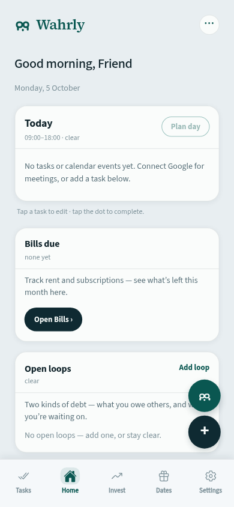
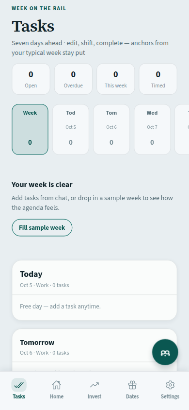
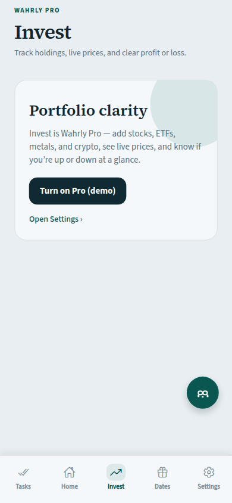
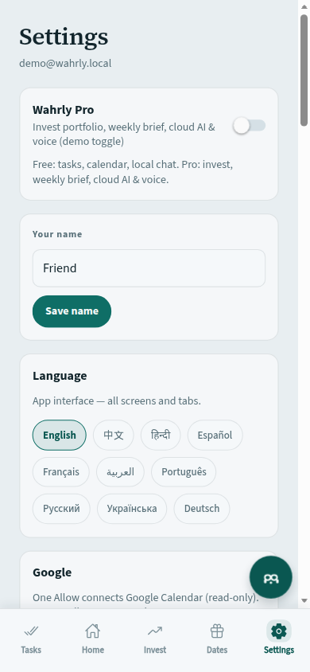
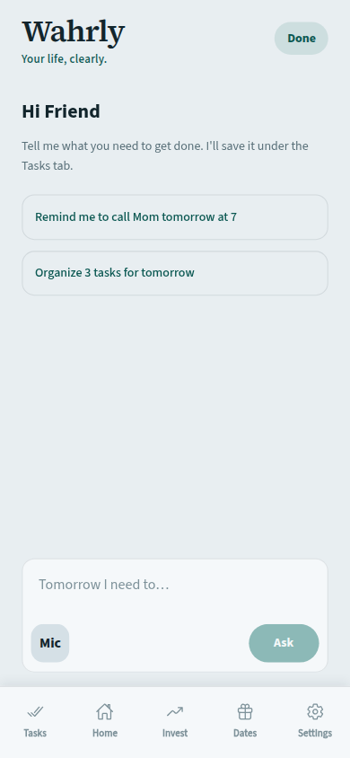
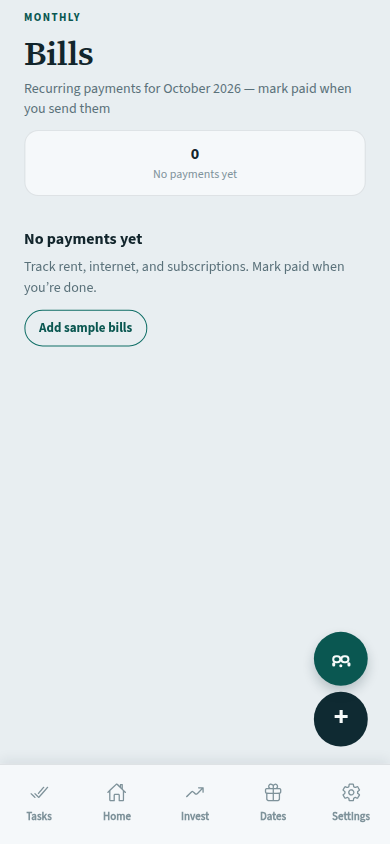

# Wahrly — TestFlight (build 36 / 1.1.0)

Материалы для App Store Connect → TestFlight: описание, What to Test, Free/Pro, скрины.

---

## Beta App Description (коротко)

**RU**

Wahrly — ассистент дня: задачи, Plan day, Google Calendar (только чтение), счета, даты, новости и AI. Pro — облачный чат, голос и Invest (введи «gold» — подтянется цена). Почту не читаем.

**EN**

Wahrly is a daily life assistant: tasks, Plan day, Google Calendar (readonly), bills, dates, news, and AI. Pro unlocks cloud chat, voice, and Invest (type “gold” for live price). No email access.

---

## What to Test (RU) — вставить в TestFlight

```
Wahrly 1.1.0 (build 36) — MVP life assistant

ЧТО ПРОВЕРИТЬ
1) Onboarding / имя / язык (RU или EN).
2) Tasks: создай задачу на сегодня, перенеси на завтра, отметь done.
3) Home → Plan day: разложи задачи по слотам.
4) Open loops: добавь «я должен» и «жду».
5) Settings → Connect with Google: только Calendar (readonly). Почта НЕ читается.
   Если раньше подключал Gmail: Disconnect → Connect заново.
6) Bills: добавь счёт, отметь paid.
7) Dates / Life: важная дата и документ с сроком.
8) News: интересы и лента «вчера».
9) Free vs Pro (Settings → тумблер Pro, демо):
   Free: задачи, календарь, ритуалы, локальный чат.
   Pro: облачный AI, голос, Invest, weekly brief.
10) Invest (Pro): добавь holding — набери «gold» или «bitcoin», выбери из списка, проверь live-цену.
11) Пуши: morning / evening / bills (разрешить уведомления).
12) Виджет «Next task» (опционально).

НЕ БАГ
• Почта / Gmail отсутствуют намеренно (без CASA).
• Иконка в старых пушах может быть старой до перезагрузки iPhone — на Home должна быть бирюзовая W.

ОТЧЁТ
Напиши: устройство + iOS, что ок / что сломано, скрин при баге.
```

---

## What to Test (EN)

```
Wahrly 1.1.0 (build 36) — MVP life assistant

PLEASE TRY
1) Onboarding / name / language.
2) Tasks: create, reschedule, complete.
3) Home → Plan day.
4) Open loops: “I owe” + “Waiting”.
5) Settings → Connect with Google — Calendar readonly only (no mail).
   If you connected Gmail before: Disconnect → Connect again.
6) Bills / Dates / Life / News.
7) Free vs Pro (Settings demo toggle):
   Free = tasks, calendar, rituals, on-device chat.
   Pro = cloud AI, voice, Invest, weekly brief.
8) Invest (Pro): type “gold” or “bitcoin”, pick suggestion, confirm live price.
9) Notifications + optional Home Screen widget.

NOT A BUG
• No email/Gmail by design.
• Stale notification icons: reboot iPhone; Home icon should be teal W.

Feedback: device + iOS + what broke (screenshot helps).
```

---

## Free vs Pro

| | Free | Pro (демо-тумблер в Settings) |
|--|:----:|:----:|
| Tasks / Bills / Life / Dates / News | ✅ | ✅ |
| Calendar readonly | ✅ | ✅ |
| Open loops, Plan day, morning/evening | ✅ | ✅ |
| Local AI chat | ✅ | ✅ |
| Cloud AI chat | ❌ | ✅ (~400/день) |
| Voice | ❌ | ✅ (~200/день) |
| Invest + live quotes | ❌ | ✅ |
| Weekly brief | ❌ | ✅ |

---

## Скриншоты (iPhone viewport)

Сняты с веб-демо (Pages), для TestFlight notes и внутренней презентации. Для витрины App Store лучше переснять с реального iPhone (6.7").

| # | Экран | Файл |
|---|--------|------|
| 1 | Home | [01-home.png](./testflight-screens/01-home.png) |
| 2 | Tasks | [02-tasks.png](./testflight-screens/02-tasks.png) |
| 3 | Invest (Pro gate) | [03-invest.png](./testflight-screens/03-invest.png) |
| 4 | Settings (Pro + языки + Google) | [04-settings.png](./testflight-screens/04-settings.png) |
| 5 | Chat | [05-chat.png](./testflight-screens/05-chat.png) |
| 6 | Bills | [06-bills.png](./testflight-screens/06-bills.png) |

### Preview













---

## Куда вставить в App Store Connect

1. **Users and Access / TestFlight** → приложение Wahrly → build **36**  
2. **Test Details** → *What to Test* → вставь блок RU или EN выше  
3. *Beta App Description* → короткий абзац  
4. Скрины из `testflight-screens/` можно приложить в письмо тестерам или во внутренний Notion/Telegram
